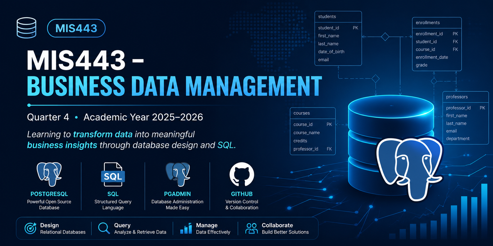

<p align="center">
  
</p>

# 🎓 MIS443 – Business Data Management

### Quarter 4 • Academic Year 2025–2026

Welcome to my MIS443 repository...

# 📖 Course Overview

This repository contains my coursework, laboratory exercises, and projects completed for **MIS443 – Business Data Management** at **Eastern International University**.

Throughout this course, I developed practical skills in relational database design, SQL programming, PostgreSQL administration, and business data management by completing hands-on database projects and SQL practice exercises.

---

# 🎯 Learning Objectives

By completing this course, I learned how to:

- Design relational databases using Entity Relationship Diagrams (ERDs)
- Create databases and tables with SQL DDL statements
- Define Primary Keys and Foreign Keys
- Import and manage data using PostgreSQL
- Write SQL queries to retrieve and analyze data
- Perform joins, aggregations, filtering, sorting, and grouping
- Apply database concepts to real-world business scenarios
- Document and manage projects using GitHub

---

# 🛠️ Technologies & Tools

<p align="center">

| Technology | Purpose |
|------------|---------|
| PostgreSQL | Relational Database Management System |
| pgAdmin 4 | Database Administration |
| SQL | Database Query Language |
| Git & GitHub | Version Control and Repository Management |

</p>

---

# 📂 Repository Contents

| Project | Description |
|---------|-------------|
| 📁 Assignment0 | Course introduction and initial exercises |
| 📁 MIS443_2032300344_School | Individual School Database Management System project |
| 📁 MIS443_DataMinds_Ecommers | Group Ecommers Database project |

---

# 📚 Course Topics

This repository demonstrates practical applications of the following database concepts:

- Relational Database Design
- Entity Relationship Diagram (ERD)
- Data Definition Language (DDL)
- Data Manipulation Language (DML)
- SQL Constraints
- Primary & Foreign Keys
- Data Import & Export
- SELECT Statements
- WHERE Clause
- ORDER BY
- DISTINCT
- Aggregate Functions
- GROUP BY
- HAVING
- INNER JOIN
- NULL Handling
- Database Documentation

---

# 🚀 Featured Project

## 🎓 School Database Management System

A PostgreSQL database project simulating a university management system.

### Features

- Database creation
- Table design
- CSV data import
- SQL query implementation
- Entity Relationship Diagram (ERD)
- Technical documentation

📂 **Project Folder**

```text
MIS443_2032300344_School
```

---

# 📁 Repository Structure

```text
MIS443-Q4-2025_2026
│
├── Assignment0
│
├── MIS443_2032300344_School
│   ├── codes
│   ├── data
│   ├── report
│   └── README.md
│
├── MIS443_DataMinds_Ecommers
│
└── README.md
```

---

# 🎓 Course Information

| Item | Details |
|------|---------|
| Course | MIS443 – Business Data Management |
| Semester | Quarter 4 – 2025–2026 |
| Institution | Eastern International University |
| Instructor | Dang Thai Doan |

---

# 👩‍🎓 Student Information

**Name:** Nguyen Thi Anh Tuyet

**Student ID:** 2332300334

---

# 📌 Notes

Each project folder includes its own documentation, SQL scripts, datasets, and supporting files. Please refer to the corresponding **README.md** inside each project for detailed setup instructions and implementation details.

---

<p align="center">

### ⭐ Thank you for visiting my MIS443 repository!

*"Good database design is the foundation of reliable business information systems."*

</p>
